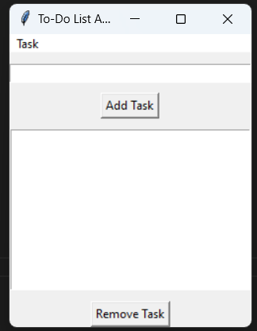

# To-Do List App

A simple To-Do list application with a graphical user interface (GUI) built using Python and tkinter.

## Features

- Add tasks along with date and time
- Update task content
- View tasks with their corresponding date and time
- Remove tasks
- Set reminders for tasks (basic reminder mechanism)

## Getting Started

### Prerequisites

- Python 3.x

### Installation

1. Clone the repository:
git clone https://github.com/your-username/todo-app.git
cd todo-app

2. Run the application:
python todo_app.py

## How to Use

1. Enter a task in the input field and click "Add Task" to add it to the list.
2. Select a task from the list to perform actions on it:
- Click "Update Task" to update the task's content.
- Click "Remove Task" to remove the task.
- Click "Set Reminder" to set a reminder time for the task.
3. Click "View Tasks" to see the list of tasks and their date/time information.

## Screenshots

## Contributions

Contributions are welcome! If you find any issues or want to enhance the application, feel free to create a pull request.

## License

This project is licensed under the [MIT License](LICENSE).

## Acknowledgements

- The application was inspired by the need for a simple To-Do list manager.
- Thanks to the Python and tkinter communities for creating and maintaining these libraries.